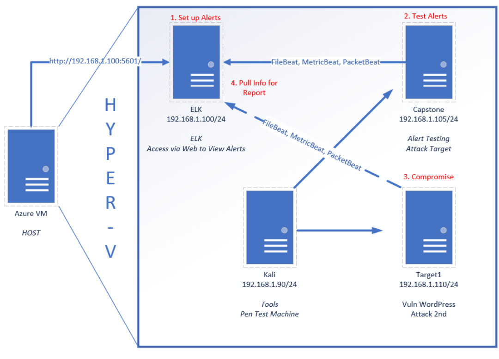

# Blue Team: Summary of Operations

## Table of Contents
- Network Topology
- Description of Targets
- Monitoring the Targets
- Patterns of Traffic & Behavior
- Suggestions for Going Further

### Network Topology

The following machines were identified on the network:

- Network
  - Address Range: 192.168.1.2 - 192.168.1.254
  - Netmask: 255.255.255.0
Gateway: 192.168.1.1

- Machines
  - IPv4:			192.168.1.105
    - OS:				Linux 4.15.0-108-generic
    - Hostname:	server1
  
  - IPv4:			192.168.1.100
    - OS:				Linux 4.15.0-99-generic
    - Hostname:	ELK

  - IPv4:			192.168.1.110
    - OS:				Linux 3.16.0-6-amd64
    - Hostname:	target1

  - IPv4:			192.168.1.115
    - OS:			  Linux 3.16.0-6-amd64
    - Hostname:	Target2

  - IPv4:			192.168.1.90
    - OS:				Linux 5.4.0-kali3-amd64
    - Hostname:	Kali
 

### Description of Targets

The target of this attack was: `Target 1` (192.168.1.110).

Target 1 is an Apache web server and has SSH enabled, so ports 80 and 22 are possible ports of entry for attackers. As such, the following alerts have been implemented:

### Monitoring the Targets

Traffic to these services should be carefully monitored. To this end, we have implemented the alerts below:

#### CPU Usage Monitor
Alert 1 is implemented as follows:
  - **Metric**:     system.process.cpu.total.pct
  - **Threshold**:  IS ABOVE 0.5 FOR THE LAST 5 minutes
  - **Vulnerability Mitigated**: brute force / DDOS attack
  
#### HTTP request size monitor
Alert 2 is implemented as follows:
  - **Metric**:     http.request.bytes
  - **Threshold**:  IS ABOVE 3500 FOR THE LAST 1 minute
  - **Vulnerability Mitigated**: Potential download / uploading of files
  - **Reliability**: Medium - high reliability. Most standard web / http traffic will not trigger the alert.

#### Excessive HTTP Errors
Alert 3 is implemented as follows:
  - **Metric**:     http.response.status_code
  - **Threshold**:  ABOVE 400 FOR THE LAST 5 minutes
  - **Vulnerability Mitigated**: Brute force http attack