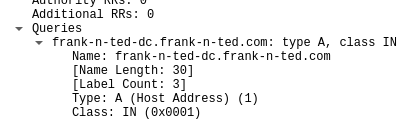
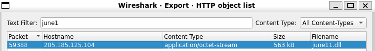
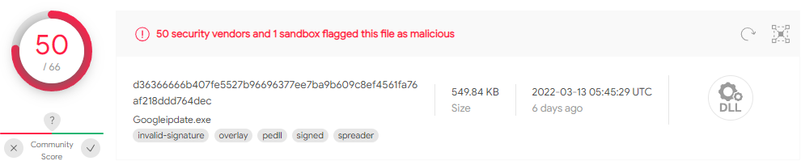
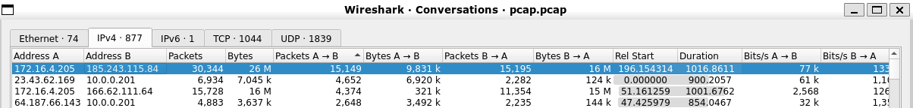

# Network Forensic Analysis Report


## Time Thieves 
You must inspect your traffic capture to answer the following questions:

1. What is the domain name of the users' custom site?

    `Domain Name: frank-n-ted.com`

2. What is the IP address of the Domain Controller (DC) of the Active Directory network?

    `ip.src== 10.6.12.0/24 && dns`
    
    

    

3. What is the name of the malware downloaded to the 10.6.12.203 machine?
   
   `June11.dll`
   
   

4. Upload the file to [VirusTotal.com](https://www.virustotal.com/gui/). 

    

5. What kind of malware is this classified as?
    
    `Classified as a Trojan `
---

## Vulnerable Windows Machine

1. Find the following information about the infected Windows machine:
    - Host name:    Rotterdam-PC
    - IP address:   172.16.4.205
    - MAC address:  00:59:07:b0:63:a4
    
2. What is the username of the Windows user whose computer is infected?
    - matthijs.devries

3. What are the IP addresses used in the actual infection traffic?
    - 185.243.115.84
    

4. As a bonus, retrieve the desktop background of the Windows host.
    

---

## Illegal Downloads

1. Find the following information about the machine with IP address `10.0.0.201`:
    - MAC address:          00:16:17:18:66:c8
    - Windows username:     elmer.blanco
    - OS version:           Windows 10 / 11 based on browser http user agent
     
         ```bash
         User-Agent: Mozilla/5.0 (Windows NT 10.0; Win64; x64) AppleWebKit/537.36 (KHTML, like Gecko) Chrome/64.0.3282.140 Safari/537.36 Edge/17.17134
         ```


2. Which torrent file did the user download?
    - ip.src == 10.0.0.201 && http.request.method == GET
    - /bt/btdownload.php?type=torrent&file=Betty_Boop_Rhythm_on_the_Reservation.avi.torrent